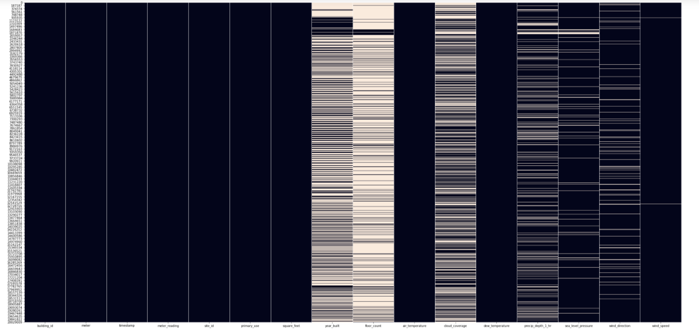

#### Team : 
- YECHCHI Sif-Eddine 
- NAIT ABDELLA
- EL ADAMI Hichem 
- EL JAMIY Mohamed

Pour nous contacter, rendez-vous sur [Discord](https://discord.gg/Tz7u4JWW) !

## Subject: ASHRAE Energy Prediction 

#### Données:

The data contains 3 files: 

* train : de taille (20216100, 4)
* building_meta : de taille (1449, 6)
* weather_train : de taille (139773, 9) 

First, we have **merged** the files to have a single file that we called train.
The size of the train file is: (20216100, 16).

Then, we have **reduced the memory** of the data:

* Memory usage of dataframe was: 2622.02 MB
* Memory usage after optimization: 790.84 MB

=> Decreased by 69.8%

#### Missing values: 

There are the percentages of missing values for each variable: 

Then, we have 
- converted the variable **timestamp** to a date_time variable
- replaced the four values of the variable **meter** by their real values: (0:"electricity",1:"chilledwater",2:"steam",3:"hotwater") 

 

